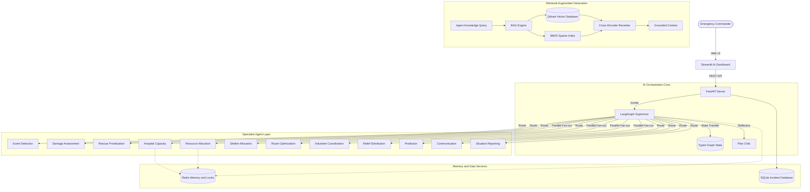
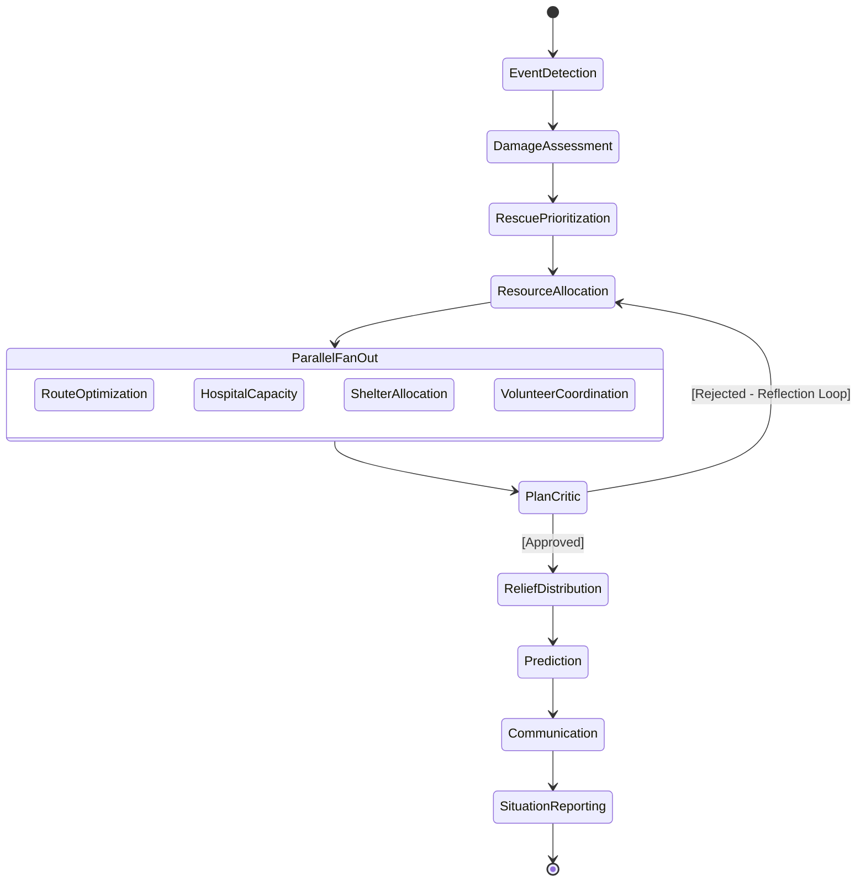
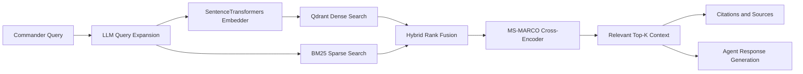
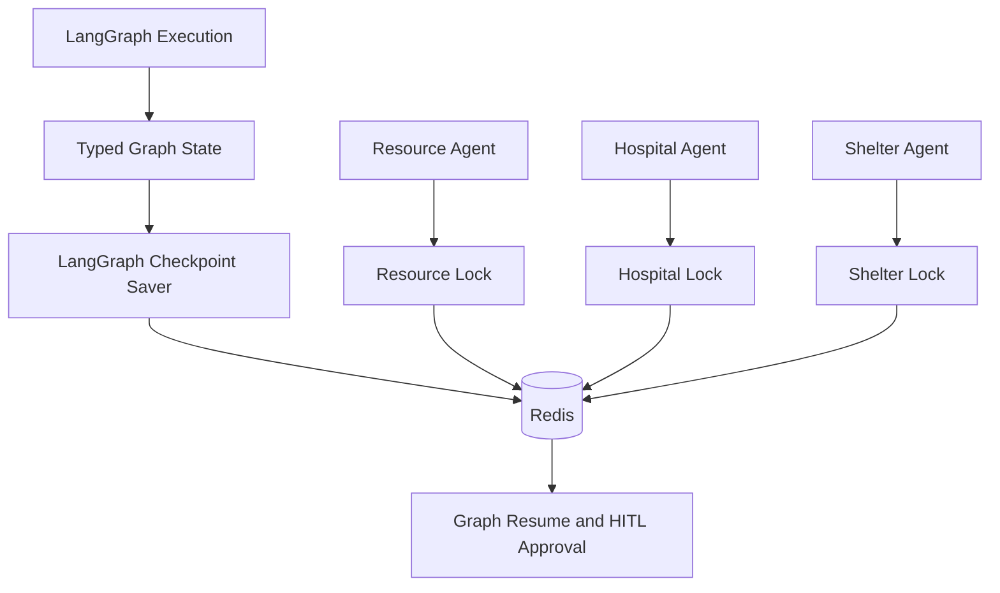

# RescueNet AI — Project Report Knowledge Base

> **Purpose:** This document is a detailed, report-ready knowledge base for preparing an academic, technical, or competition project report about RescueNet AI.
>
> **Project identity:** RescueNet AI is an autonomous multi-agent AI/ML disaster-response orchestration platform that combines large-language-model reasoning, LangGraph stateful workflows, LangChain agent pipelines, Retrieval-Augmented Generation, Qdrant vector search, Redis operational memory, structured Pydantic outputs, human-in-the-loop control, geospatial visualization, and FastAPI services.

---

## 1. Project Title

**RescueNet AI: An Autonomous Multi-Agent AI Command Center for Disaster Response**

### Suggested report subtitle

**A LangGraph-Orchestrated, Retrieval-Augmented Multi-Agent System for Intelligent Emergency Resource Coordination**

---

## 2. Abstract

RescueNet AI is an AI/ML platform designed to support disaster-response coordination across emergency operations, healthcare capacity, evacuation, logistics, shelters, volunteers, relief distribution, communication, and incident reporting. The platform receives a structured disaster trigger and transforms it into a coordinated response plan through a LangGraph state machine containing specialized AI agents.

The system addresses a major operational problem in disaster management: information and decision-making are often distributed across hospitals, responders, shelters, government departments, volunteer groups, and logistics teams. RescueNet AI provides a shared intelligence layer in which a supervisor agent coordinates domain-specific agents over a common typed graph state. The agents analyze disaster conditions, assess affected areas, prioritize rescue targets, allocate resources, optimize routes, assign hospital and shelter capacity, coordinate volunteers, plan relief supplies, generate forecasts, publish alerts, and synthesize a situation report.

The platform uses Retrieval-Augmented Generation to ground responses in emergency operating procedures and official guidelines. Qdrant stores vector representations of knowledge documents, BM25 provides lexical retrieval for exact terms, and a cross-encoder reranks candidate passages. Redis supports shared working memory, distributed locks, and LangGraph checkpointing, while SQLite stores incident history. A Streamlit dashboard presents the results through maps, metrics, tables, alerts, and agent execution timelines. FastAPI exposes the orchestration engine through documented REST endpoints.

The architecture combines AI reasoning with structured state management, operational constraints, human approval checkpoints, and auditable execution traces. This design makes RescueNet AI suitable for academic research, emergency-management demonstrations, AI-agent experimentation, and future integration with live telemetry and response infrastructure.

### Keywords

`Artificial Intelligence`, `Machine Learning`, `Multi-Agent Systems`, `LLM`, `LangGraph`, `LangChain`, `RAG`, `Qdrant`, `Redis`, `Disaster Response`, `Emergency Management`, `Human-in-the-Loop`, `Geospatial Analytics`, `FastAPI`, `Streamlit`

---

## 3. Problem Statement

Large-scale disasters create a high-volume, high-urgency coordination problem. A single incident may require simultaneous decisions about:

- Which locations are most affected.
- Which victims or facilities need immediate attention.
- Which ambulances, rescue vehicles, boats, or helicopters are available.
- Which roads are usable.
- Which hospitals have ICU or general-bed capacity.
- Which shelters have available capacity.
- Which volunteers have suitable skills.
- How much food, water, medical material, and shelter equipment is required.
- What public communication should be issued.
- How the situation may evolve over the next several hours.

Traditional systems often expose isolated dashboards or databases for individual agencies. Operators must manually combine information, which introduces delay, duplicated assignments, stale data, inconsistent priorities, and communication gaps.

RescueNet AI addresses this problem by treating the response as a coordinated stateful reasoning process. A supervisor controls a graph of specialized agents, each responsible for one operational domain. The agents exchange structured state rather than unstructured messages, allowing the platform to validate, trace, and display every stage of the response.

---

## 4. Proposed Solution

RescueNet AI provides an AI-powered command center with five major design ideas:

1. **Specialized intelligence:** divide disaster response into domain-specific AI agents.
2. **Stateful orchestration:** coordinate the agents through a LangGraph state machine.
3. **Knowledge grounding:** use RAG to retrieve emergency procedures and supporting evidence.
4. **Operational memory:** use Redis, SQLite, and Qdrant for shared state, history, and knowledge retrieval.
5. **Human governance:** pause sensitive stages for operator review and approval.

The platform transforms a disaster request such as:

```json
{
  "disaster_type": "flood",
  "location_name": "Delhi NCR",
  "lat": 28.6139,
  "lon": 77.2090
}
```

into a structured situation report containing:

- Event classification.
- Damage reports.
- Rescue priorities.
- Resource assignments.
- Route information.
- Hospital allocations.
- Shelter allocations.
- Relief requirements.
- Volunteer assignments.
- Forecasts.
- Communication alerts.
- Narrative situation summary.
- Agent execution trace.

---

## 5. Objectives

### 5.1 Primary objectives

- Build a multi-agent AI architecture for emergency response.
- Coordinate multiple specialist agents through a shared graph state.
- Ground AI outputs in emergency-management knowledge.
- Produce structured and machine-readable operational decisions.
- Model resource constraints such as vehicle availability, hospital beds, shelter capacity, and volunteer skills.
- Provide operators with an explainable execution timeline.
- Support human review before high-impact operational stages.

### 5.2 Technical objectives

- Use LangGraph for graph-based agent orchestration.
- Use LangChain-compatible agent pipelines.
- Apply Pydantic schemas to validate model-generated outputs.
- Combine dense vector search and BM25 lexical retrieval.
- Apply cross-encoder reranking to improve retrieved context quality.
- Use Redis for locks, shared memory, and checkpoint state.
- Store incidents and reports in SQLite.
- Expose the system through a FastAPI REST API.
- Provide an interactive Streamlit and PyDeck dashboard.
- Package the services using Docker and Docker Compose.

### 5.3 Social and operational objectives

- Improve disaster-response coordination.
- Reduce resource duplication.
- Improve response-time awareness.
- Support evidence-grounded communication.
- Improve visibility into hospital and shelter capacity.
- Help decision-makers understand the consequences of resource allocation.

---

## 6. Scope of the System

### Included scope

- Flood, earthquake, wildfire, storm, landslide, and related disaster workflows.
- Disaster-event ingestion through a REST endpoint.
- Multi-agent response planning.
- Operational resource and facility state.
- RAG-based emergency knowledge retrieval.
- Hospital and shelter capacity assignment.
- Geospatial response visualization.
- Incident history and report persistence.
- Human approval checkpoints.
- Structured logs and execution traces.
- Containerized deployment.

### Extension scope

The architecture is prepared for future integration with:

- Live weather feeds.
- Satellite imagery.
- IoT sensors.
- Traffic APIs.
- Emergency dispatch systems.
- Hospital information systems.
- SMS and messaging gateways.
- Government emergency-data feeds.
- Additional LLM providers and embedding models.
- Multi-region deployment with managed Redis and Qdrant.

---

## 7. High-Level Architecture



### Architecture layers

| Layer | Main responsibility | Technologies |
|:---|:---|:---|
| Presentation | Command dashboard, maps, tables, alerts, metrics | Streamlit, PyDeck, Plotly |
| API | Validation, routing, documentation, service boundary | FastAPI, Uvicorn, Pydantic |
| Orchestration | Stateful graph execution and agent routing | LangGraph |
| Agent intelligence | Domain-specific reasoning and structured outputs | LangChain, LLM APIs |
| Retrieval | Knowledge grounding and citations | Qdrant, BM25, SentenceTransformers, Cross-Encoder |
| Memory | Locks, checkpoints, shared coordination state | Redis, LangGraph Saver |
| Persistence | Historical incidents and operational records | SQLite |
| Deployment | Reproducible service packaging | Docker, Docker Compose, Render |

---

## 8. Frontend Architecture

The frontend is implemented using Streamlit and provides a command-center interface for emergency operators.

### 8.1 Dashboard responsibilities

- Submit disaster triggers.
- Display current system state.
- Show incident history.
- Query the RAG knowledge base.
- Display response metrics.
- Render affected locations on an interactive map.
- Show hospitals, shelters, resources, routes, and volunteers.
- Display alerts and forecasts.
- Present the LangGraph agent execution timeline.

### 8.2 Geospatial visualization

PyDeck provides map layers for operational intelligence:

- **HeatmapLayer:** damage and intensity visualization.
- **ScatterplotLayer:** hospitals, shelters, facilities, and affected points.
- **ArcLayer:** resource-to-target routes and logistics movement.
- **Map state:** latitude, longitude, zoom, and response-area boundaries.

### 8.3 Frontend-backend contract

The dashboard reads the backend URL from `API_BASE` and communicates through REST requests. The frontend remains separate from the AI orchestration layer, allowing the same API to be consumed by:

- Streamlit.
- Postman.
- Mobile clients.
- External dashboards.
- Future web applications.

---

## 9. Backend Architecture

FastAPI is the service gateway for the entire platform.

### Backend responsibilities

- Accept and validate disaster trigger requests.
- Invoke the LangGraph response workflow.
- Expose operational state and incident history.
- Provide RAG search and ingestion routes.
- Apply request rate limits.
- Generate OpenAPI documentation.
- Return Pydantic-validated response objects.
- Emit structured logs and execution metrics.
- Persist incident reports.

### Main API modules

| Module | Responsibility |
|:---|:---|
| `backend/main.py` | FastAPI application, middleware, health, trigger, state, incidents, RAG route registration. |
| `backend/models/schemas.py` | Request and response schemas. |
| `backend/agents/orchestrator.py` | Pipeline invocation and graph execution configuration. |
| `backend/agents/supervisor_v2.py` | LangGraph graph construction, routing, reflection, and HITL checkpoints. |
| `backend/rag/api.py` | RAG search and document-ingestion endpoints. |
| `backend/rag/rag_engine.py` | Embedding, retrieval, reranking, filtering, and response construction. |
| `backend/database.py` | SQLite incident persistence and operational state. |
| `backend/core/memory.py` | Redis locks, memory management, and checkpoint support. |
| `backend/core/state.py` | Shared graph-state definition and state channels. |

---

## 10. LangGraph Orchestration

LangGraph represents the disaster response as a directed state graph. Each node receives the current graph state, performs its domain operation, and returns structured updates that LangGraph merges into the state.



### 10.1 Sequential phase

The initial phase has strict dependencies:

1. **Event Detection:** identifies the disaster event and normalizes the trigger.
2. **Damage Assessment:** estimates the spatial impact and affected entities.
3. **Rescue Prioritization:** ranks affected targets by severity and urgency.
4. **Resource Allocation:** assigns available response resources to the highest priorities.

### 10.2 Parallel fan-out phase

After resource allocation, multiple agents can work from the shared state:

- Route Optimization.
- Hospital Capacity.
- Shelter Allocation.
- Volunteer Coordination.

Parallel execution allows the system to calculate independent operational decisions without waiting for unrelated tasks to finish.

### 10.3 Reflection phase

The PlanCritic agent evaluates the combined plan. It examines resource assignments, hospital capacity, shelter capacity, and operational consistency. If the plan is rejected, the supervisor routes execution back to Resource Allocation so that assignments can be revised.

### 10.4 Finalization phase

After plan approval, the final agents generate:

- Relief distribution requirements.
- Forecasts.
- Emergency communication.
- Executive situation report.

### 10.5 Human-in-the-loop control

The workflow contains approval checkpoints before sensitive operations such as physical resource allocation and public communication. The graph state is checkpointed so an operator can inspect the plan and approve continuation through an API action.

---

## 11. Specialist AI Agents

RescueNet AI divides the emergency-response problem into specialized agent roles.

| Agent | Responsibility | Input | Output |
|:---|:---|:---|:---|
| Supervisor | Routes graph execution and manages dependencies. | `GraphState` | Next-node routing decisions |
| PlanCritic | Evaluates allocation quality and triggers reflection. | Combined operational state | Approval or rejection |
| Event Detection | Classifies and structures the incoming incident. | `DisasterTriggerRequest` | `DisasterEvent` |
| Damage Assessment | Estimates spatial impact, casualties, and facility damage. | `DisasterEvent` | `List[DamageReport]` |
| Rescue Prioritization | Ranks targets based on severity and vulnerability. | Damage reports and POIs | `List[PriorityItem]` |
| Resource Allocation | Assigns vehicles and equipment to targets. | Priorities and fleet state | `List[ResourceAssignment]` |
| Route Optimization | Selects routes and accounts for road status. | Assignments and route data | `List[RouteInfo]` |
| Hospital Capacity | Assigns casualties to medical facilities. | Damage reports and hospital state | `List[HospitalAssignment]` |
| Shelter Allocation | Assigns displaced people to shelters. | Damage reports and shelter state | `List[ShelterAssignment]` |
| Volunteer Coordination | Matches volunteer skills to response needs. | Priorities and volunteer registry | `List[VolunteerAssignment]` |
| Relief Distribution | Calculates food, water, blankets, and medical kits. | Affected-population state | Relief plan |
| Prediction | Forecasts future impact and response demand. | Damage and operational state | `List[Forecast]` |
| Communication | Generates public and responder alerts. | Response plan and shelter state | `List[Alert]` |
| Situation Reporting | Synthesizes the final executive report. | Complete `GraphState` | Markdown narrative |

### 11.1 Structured output pattern

Each agent is designed around a schema contract. A representative pattern is:

```python
structured_llm = llm.with_structured_output(ResourceAssignmentList)
result = structured_llm.invoke(prompt)
```

This ensures that generated results can be validated before they are merged into the graph state.

### 11.2 Agent tool pattern

Agents can call domain tools before generating their final output. Examples include:

- Location and geocoding functions.
- OpenStreetMap and Overpass queries.
- ETA and distance calculations.
- Traffic and route functions.
- Weather and forecast tools.
- Hospital telemetry functions.
- Shelter-condition functions.
- Volunteer availability and skill matching.
- Historical incident retrieval.

### 11.3 ReAct prediction pattern

The Prediction Agent follows a tool-augmented reasoning sequence:

1. Read the current state.
2. Identify missing forecast information.
3. Call the weather or forecast tool.
4. Add the tool result to the conversation state.
5. Produce a structured forecast list.
6. Return the forecast to the supervisor graph.

---

## 12. Shared Graph State

The graph state is the central contract between agents. It prevents every agent from inventing an independent view of the incident.

### Major state domains

- Incident metadata.
- Disaster event.
- Damage reports.
- Points of interest.
- Rescue priorities.
- Resource inventory.
- Resource assignments.
- Route information.
- Hospital capacity and assignments.
- Shelter capacity and assignments.
- Volunteer registry and assignments.
- Relief requirements.
- Forecasts.
- Communication alerts.
- Historical incidents.
- Execution history.
- Completed tasks.
- Retry and reflection metadata.
- Human approval status.

### State design principles

- Pydantic validation at input and output boundaries.
- Explicit list and object defaults.
- Reducer functions for parallel state updates.
- Traceable execution history.
- Separation between live operational state and incident history.
- Consistent identifiers for events, resources, facilities, and assignments.

---

## 13. Retrieval-Augmented Generation

The RAG subsystem grounds agent responses in operational knowledge rather than relying exclusively on model parameters.



### 13.1 Query expansion

A query-expansion model can enrich a user query with:

- Disaster-management synonyms.
- FEMA and emergency-management terminology.
- Related operational phrases.
- Domain-specific terms.
- Alternative wording used in knowledge documents.

This improves recall for natural-language questions that do not exactly match document vocabulary.

### 13.2 Dense retrieval

SentenceTransformers embeddings represent documents and queries as vectors. The project uses the `all-MiniLM-L6-v2` family with 384-dimensional vectors. Qdrant stores and searches the embeddings using cosine similarity.

Dense retrieval is useful when the query and document use different words but express the same concept.

### 13.3 Sparse retrieval

BM25 provides lexical retrieval for:

- Exact protocol names.
- Facility names.
- Named locations.
- Emergency codes.
- Specific terms and abbreviations.
- Queries where exact word overlap is important.

### 13.4 Hybrid retrieval

The RAG engine merges dense and sparse candidates, removes duplicate passages, applies metadata filters, and prepares a candidate set for reranking.

### 13.5 Cross-encoder reranking

The cross-encoder evaluates the query and candidate passage together. This provides a more precise relevance score than comparing independent embeddings alone. Low-relevance candidates are excluded before context generation.

### 13.6 Citations and answer metadata

RAG responses include:

- Answer text.
- Source name.
- Passage snippet.
- Relevance score.
- Confidence score.
- Processing time.

### 13.7 Document ingestion

Documents can be submitted through `/api/rag/ingest`. Each document includes text and optional metadata such as:

- Source organization.
- Disaster type.
- Agency.
- Protocol category.
- Document version.
- Geographic applicability.

---

## 14. Redis Memory Architecture

Redis provides shared coordination for agents running against common operational state.



### Working memory

When a resource agent wants to mutate a shared resource, it obtains a Redis lock. A typical allocation sequence is:

1. Request lock for a resource or resource group.
2. Read current availability.
3. Validate capacity and assignment conditions.
4. Update the live state.
5. Release the lock.
6. Return the assignment to the graph state.

### Checkpoint memory

LangGraph checkpoints preserve the state of the graph between node transitions. This is important when the workflow reaches an approval checkpoint. An operator can inspect the state, provide feedback, and resume the graph using the incident thread identifier.

### Memory benefits

- Prevents duplicate resource allocation.
- Preserves graph state across approval steps.
- Supports multiple application processes.
- Provides a shared state boundary between agents.
- Supports operational auditing.

---

## 15. Qdrant Vector Database

Qdrant stores the semantic representation of emergency knowledge documents.

### Qdrant responsibilities

- Store document vectors.
- Store source and operational metadata.
- Execute dense similarity search.
- Filter by disaster type or agency.
- Return top candidate passages.
- Support scalable document collections.

### Collection design

The primary knowledge collection contains:

- Embedding vector.
- Passage text.
- Source name.
- Disaster type.
- Agency.
- Document metadata.
- Passage identifier.

### Example metadata

```json
{
  "source": "FEMA Flood Protocol",
  "disaster_type": "flood",
  "agency": "emergency_management",
  "type": "guideline"
}
```

### Benefits of Qdrant

- Fast approximate-nearest-neighbor retrieval.
- Metadata-aware filtering.
- Separation of knowledge storage from application code.
- Cloud and local deployment options.
- Suitable for future knowledge-base expansion.

---

## 16. Operational Simulation and State Modeling

The platform represents the operational environment as structured state so that agents can reason over capacity and constraints.

### Modeled entities

- Hospitals.
- ICU and general beds.
- Shelters and cots.
- Ambulances.
- Fire trucks.
- Rescue boats.
- Helicopters.
- Volunteers.
- Roads and route conditions.
- Affected zones.
- Population and casualty estimates.
- Relief inventory.

### Simulation tick model

The simulation engine advances operational state through time-based ticks. A tick can update:

- Disaster severity.
- Weather-related impact.
- Resource location.
- Resource fatigue.
- Hospital capacity.
- Shelter occupancy.
- Secondary incident risk.
- Response demand.

The purpose of the simulation is to provide a controlled environment in which the AI agents can observe changing conditions and recalculate response decisions.

### Agent integration

The simulation state is read by the LangGraph agents. After a state update, the supervisor can run a new response cycle so that resource allocation, routing, shelter planning, and hospital assignment reflect the latest operational conditions.

---

## 17. Human-in-the-Loop Governance

Emergency AI systems must provide operator control around high-impact decisions. RescueNet AI places approval checkpoints around resource dispatch and public communication.

### HITL process

1. The supervisor reaches a protected graph edge.
2. LangGraph interrupts execution.
3. The graph state is checkpointed.
4. The operator reviews assignments, alerts, and capacity.
5. The operator approves or rejects the plan.
6. Feedback is stored with the workflow thread.
7. The graph resumes from the checkpoint.

### Benefits

- Prevents unreviewed resource dispatch.
- Reduces the risk of incorrect public messaging.
- Provides a clear accountability boundary.
- Supports audit trails.
- Allows expert feedback to influence the next graph cycle.

---

## 18. API Specification

The FastAPI service exposes OpenAPI documentation at `/docs` and `/redoc`.

### Health

```http
GET /health
```

### Root service information

```http
GET /
```

### Disaster trigger

```http
POST /api/disaster/trigger
Content-Type: application/json
```

Request:

```json
{
  "disaster_type": "earthquake",
  "location_name": "Delhi NCR",
  "lat": 28.6139,
  "lon": 77.2090
}
```

Response domains:

```text
SituationReport
├── event
├── damage_reports
├── priorities
├── resource_assignments
├── routes
├── hospital_assignments
├── shelter_assignments
├── relief_plan
├── volunteer_assignments
├── alerts
├── forecasts
├── narrative_summary
└── trace
```

### RAG search

```http
POST /api/rag/search
Content-Type: application/json
```

```json
{
  "query": "What should emergency teams do during a flood?",
  "top_k": 5
}
```

### RAG ingestion

```http
POST /api/rag/ingest
Content-Type: application/json
```

```json
[
  {
    "text": "Emergency procedure text...",
    "metadata": {
      "source": "Agency Manual",
      "disaster_type": "flood"
    }
  }
]
```

### State and incident endpoints

| Method | Endpoint | Description |
|:---|:---|:---|
| `GET` | `/api/state` | Current hospitals, shelters, resources, and volunteers. |
| `GET` | `/api/simulation/state` | Current simulation state. |
| `POST` | `/api/simulation/tick` | Advance the simulation by one or more ticks. |
| `POST` | `/api/reset` | Reset operational state. |
| `GET` | `/api/incidents` | List saved incident reports. |
| `GET` | `/api/incidents/{incident_id}` | Retrieve one incident report. |

---

## 19. Technology Stack

| Category | Technologies |
|:---|:---|
| Programming language | Python 3.12+ |
| API | FastAPI, Uvicorn, Gunicorn, Pydantic |
| AI orchestration | LangGraph, LangChain |
| Model provider | Groq/Llama-compatible API integration |
| Retrieval | Qdrant, BM25, SentenceTransformers |
| Reranking | MS-MARCO Cross-Encoder |
| Shared memory | Redis, distributed locks, checkpoint persistence |
| Database | SQLite |
| Frontend | Streamlit, PyDeck, Plotly |
| Containerization | Docker, Docker Compose |
| Observability | Structured JSON logging, metrics, agent traces |
| Testing | Pytest, Pytest-Asyncio, Pytest-Cov |
| Deployment | Render-compatible Python web services |

---

## 20. Project Structure

```text
rescuenet-ai/
├── backend/
│   ├── agents/
│   │   ├── communication.py
│   │   ├── damage_assessment.py
│   │   ├── event_detection.py
│   │   ├── hospital_capacity.py
│   │   ├── orchestrator.py
│   │   ├── prediction.py
│   │   ├── relief_distribution.py
│   │   ├── rescue_prioritization.py
│   │   ├── resource_allocation.py
│   │   ├── route_optimization.py
│   │   ├── shelter_allocation.py
│   │   ├── situation_reporting.py
│   │   ├── supervisor_v2.py
│   │   └── volunteer_coordination.py
│   ├── core/
│   │   ├── config.py
│   │   ├── logging.py
│   │   ├── memory.py
│   │   ├── protocol.py
│   │   └── state.py
│   ├── models/
│   │   └── schemas.py
│   ├── rag/
│   │   ├── api.py
│   │   ├── models.py
│   │   └── rag_engine.py
│   ├── database.py
│   └── main.py
├── frontend/
│   ├── app.py
│   └── requirements.txt
├── docs/
│   ├── AI_AGENTS.md
│   ├── API_REFERENCE.md
│   ├── ARCHITECTURE.md
│   ├── LANGGRAPH_WORKFLOW.md
│   ├── MEMORY_ARCHITECTURE.md
│   ├── RAG_DESIGN.md
│   ├── SIMULATION_ENGINE.md
│   └── ...
├── tests/
│   ├── test_core.py
│   ├── test_memory.py
│   ├── test_rag.py
│   ├── test_simulation.py
│   └── test_supervisor.py
├── docker-compose.yml
├── Dockerfile.backend
├── Dockerfile.frontend
├── render.yaml
├── requirements.txt
└── README.md
```

---

## 21. Installation

### Prerequisites

- Python 3.12+
- Docker and Docker Compose
- Redis
- Qdrant
- Groq/Llama-compatible API credentials

### Clone

```bash
git clone https://github.com/narayan8447/rescuenet-ai.git
cd rescuenet-ai
```

### Python environment

```bash
python3 -m venv .venv
source .venv/bin/activate
pip install --upgrade pip
pip install -r requirements.txt
pip install -r frontend/requirements.txt
```

### Environment configuration

```env
GROQ_API_KEY=gsk_your_groq_api_key_here
GROQ_MODEL=llama-3.3-70b-versatile
REDIS_URL=redis://redis:6379/0
QDRANT_URL=http://qdrant:6333
API_BASE=http://backend:8000
USE_FAKE_REDIS=false
```

### Docker Compose

```bash
docker compose up --build -d
```

Service URLs:

- Streamlit dashboard: `http://localhost:8501`
- FastAPI API: `http://localhost:8000`
- Swagger UI: `http://localhost:8000/docs`
- Qdrant dashboard: `http://localhost:6333/dashboard`

### Local service commands

Backend:

```bash
uvicorn backend.main:app --host 127.0.0.1 --port 8000 --reload
```

Frontend:

```bash
API_BASE=http://127.0.0.1:8000 streamlit run frontend/app.py --server.port 8501
```

---

## 22. Deployment Architecture

The project supports a two-service web deployment:

### Backend service

- Python web service.
- Installs `requirements.txt`.
- Runs FastAPI with Uvicorn.
- Exposes `$PORT`.
- Provides health and OpenAPI endpoints.

### Frontend service

- Python web service.
- Installs `frontend/requirements.txt`.
- Runs Streamlit on `$PORT`.
- Receives the backend URL through `API_BASE`.

### Container deployment

Dockerfiles are provided for:

- Backend API image.
- Streamlit frontend image.

Docker Compose coordinates:

- Backend.
- Frontend.
- Redis.
- Qdrant.

### Production infrastructure recommendations

- Managed Redis for high-availability memory.
- Qdrant Cloud or a managed vector database.
- Secret management for model-provider credentials.
- Centralized logs and metrics.
- TLS termination at the platform edge.
- Separate deployment environments for development, staging, and production.
- Horizontal scaling for API workers with shared Redis and Qdrant.

---

## 23. Testing and Evaluation

### Automated tests

The project includes tests for:

- Core agent behavior.
- Shared memory and locks.
- RAG retrieval.
- Metadata filtering.
- Hybrid search.
- Relevance thresholds.
- Query caching.
- Simulation transitions.
- Supervisor graph behavior.
- Typed state contracts.

Run the suite with:

```bash
pytest -q
```

### API testing

Health check:

```bash
curl http://127.0.0.1:8000/health
```

Trigger workflow:

```bash
curl -X POST http://127.0.0.1:8000/api/disaster/trigger \
  -H 'Content-Type: application/json' \
  -d '{
    "disaster_type": "flood",
    "location_name": "Delhi NCR",
    "lat": 28.6139,
    "lon": 77.2090
  }'
```

RAG search:

```bash
curl -X POST http://127.0.0.1:8000/api/rag/search \
  -H 'Content-Type: application/json' \
  -d '{"query":"What should emergency teams do during a flood?"}'
```

### Evaluation dimensions

| Dimension | Example metric |
|:---|:---|
| Retrieval quality | Precision@K, Recall@K, MRR, citation relevance |
| Agent validity | Schema-validation success rate |
| Workflow quality | Completion rate, retry count, reflection count |
| Allocation quality | Duplicate-assignment rate, capacity violations |
| Route quality | ETA, distance, blocked-road compliance |
| Hospital allocation | Capacity utilization and overflow rate |
| Shelter allocation | Occupancy balance and unmet demand |
| Communication | Alert completeness, language coverage, approval rate |
| System performance | End-to-end latency, node latency, throughput |
| Reliability | Error rate, checkpoint recovery rate, service availability |

### Suggested experiment design

1. Create disaster scenarios with known input conditions.
2. Run the workflow using the same initial state.
3. Record agent outputs, traces, latency, and allocations.
4. Compare outputs against manually reviewed operational criteria.
5. Test increasingly large resource pools and affected populations.
6. Evaluate retrieval with known question-document pairs.
7. Measure how reflection improves allocation consistency.
8. Repeat experiments across flood, earthquake, wildfire, storm, and landslide scenarios.

---

## 24. Security and Governance

Important security considerations include:

- Store API keys in platform secret managers.
- Do not commit `.env` files.
- Restrict CORS in a production domain-specific deployment.
- Protect approval endpoints with authentication and authorization.
- Apply rate limits to trigger and retrieval endpoints.
- Validate all model outputs with Pydantic.
- Sanitize document ingestion payloads.
- Log operator approvals and workflow identifiers.
- Avoid exposing sensitive victim information in public alerts.
- Maintain an audit trail for resource assignments and communication.

Human-in-the-loop approval is an important governance mechanism because emergency decisions can affect physical resources, medical capacity, public movement, and safety messaging.

---

## 25. Design Strengths

### 25.1 Domain decomposition

The specialist-agent model makes the architecture easier to extend. A new domain agent can be introduced with its own state contract, tools, prompt, and graph edges.

### 25.2 Stateful coordination

LangGraph enables the agents to operate over a shared state rather than producing disconnected responses.

### 25.3 Structured outputs

Pydantic contracts reduce integration errors and make outputs easier to visualize, store, validate, and test.

### 25.4 Knowledge grounding

RAG connects agent responses to operational documents, sources, and citations.

### 25.5 Concurrency

Parallel fan-out improves throughput when route, hospital, shelter, and volunteer calculations are independent.

### 25.6 Human governance

Approval checkpoints create an operational boundary between AI planning and sensitive action.

### 25.7 Observability

Agent traces, structured JSON logs, metrics, and incident histories make the response process auditable.

---

## 26. Limitations and Research Considerations

A project report should discuss the following technical considerations:

- AI decisions require validation against authoritative emergency-management policies.
- Model output quality depends on prompt design, provider behavior, and knowledge-document quality.
- Operational data integrations must be validated for freshness and accuracy.
- Geospatial and traffic results depend on the coverage and reliability of external data sources.
- Resource-allocation decisions require domain-expert review before real-world use.
- Human approval remains important for actions affecting people, public messaging, medical capacity, and physical resources.
- Simulation data should not be interpreted as live incident telemetry without a verified data integration.
- The RAG corpus requires document versioning, provenance, and periodic review.
- LLM costs, latency, rate limits, and context windows must be managed in production.

These considerations define appropriate boundaries for the current system and provide a roadmap for future research.

---

## 27. Future Enhancements

### AI and ML

- Fine-tune domain-specific classifiers for disaster-event categorization.
- Add multimodal image analysis for satellite and drone imagery.
- Integrate time-series forecasting models for flood levels and demand.
- Train route-risk models using historical traffic and road-closure data.
- Add graph neural networks for infrastructure dependency analysis.
- Use reinforcement learning for resource-dispatch policy optimization.
- Add uncertainty estimates to damage, casualty, and demand forecasts.
- Implement model routing across multiple providers.

### Data and infrastructure

- Add live weather and satellite data connectors.
- Add hospital and shelter information-system integrations.
- Replace local incident persistence with a scalable transactional database.
- Deploy Qdrant Cloud with collection versioning.
- Deploy Redis with replication and failover.
- Add centralized tracing with OpenTelemetry, Jaeger, or an APM platform.
- Add authentication, role-based access, and multi-tenant incident management.

### Product and operations

- Add mobile-first responder interfaces.
- Add multilingual dashboard support.
- Add offline-first field operations.
- Add digital evidence and document upload.
- Add operator feedback loops for agent evaluation.
- Add incident replay for training and post-event analysis.
- Add automated report export to PDF and presentation formats.

---

## 28. Suggested Report Chapter Structure

This knowledge base can be converted into the following project-report chapters:

1. **Introduction**
   - Disaster-response coordination problem.
   - Motivation for AI and multi-agent systems.
   - Project contribution.

2. **Problem Statement and Objectives**
   - Operational coordination gaps.
   - Technical and social objectives.

3. **Literature and Technology Background**
   - LLM agents.
   - RAG.
   - Vector databases.
   - Workflow orchestration.
   - Human-in-the-loop AI.

4. **System Requirements**
   - Functional requirements.
   - Non-functional requirements.
   - Security and governance requirements.

5. **System Architecture**
   - Frontend.
   - FastAPI backend.
   - LangGraph supervisor.
   - Specialist agents.
   - Redis.
   - Qdrant.
   - SQLite.

6. **Methodology**
   - Multi-agent decomposition.
   - State graph design.
   - Structured output validation.
   - RAG retrieval pipeline.
   - Resource allocation workflow.

7. **Implementation**
   - Python modules.
   - Agent prompts and tools.
   - Graph state.
   - API endpoints.
   - Dashboard.

8. **Results and Evaluation**
   - Scenario execution.
   - Retrieval metrics.
   - Pipeline latency.
   - Resource allocation quality.
   - Agent traces.

9. **Security, Ethics, and Governance**
   - Human approval.
   - Sensitive data.
   - Model reliability.
   - Public communication.

10. **Limitations and Future Work**
    - Live data integration.
    - Model evaluation.
    - Scalability.
    - Multimodal intelligence.

11. **Conclusion**
    - Contribution to AI-assisted disaster response.
    - Research and deployment potential.

---

## 29. Short Presentation Description

> RescueNet AI is an autonomous multi-agent disaster-response command center. It uses LangGraph to coordinate specialized AI agents for event detection, damage assessment, rescue prioritization, resource allocation, route optimization, hospital and shelter management, volunteer coordination, relief planning, prediction, communication, and situation reporting. Its Retrieval-Augmented Generation pipeline combines Qdrant vector search, BM25 retrieval, SentenceTransformers embeddings, and cross-encoder reranking to ground responses in emergency operating procedures. Redis provides shared memory, distributed locks, and graph checkpoints, while FastAPI and Streamlit expose the system through a live operational dashboard.

---

## 30. One-Minute Viva Explanation

RescueNet AI is a multi-agent AI system for disaster response. When a disaster is reported, the FastAPI backend sends the request to a LangGraph supervisor. The supervisor maintains a shared typed state and coordinates specialized agents. The agents assess damage, prioritize rescue targets, allocate resources, optimize routes, assign hospitals and shelters, coordinate volunteers, plan relief supplies, generate forecasts and alerts, and produce a final situation report. RAG grounds the agents in emergency manuals using Qdrant, BM25, embeddings, and a cross-encoder. Redis stores locks and graph checkpoints so concurrent agents do not allocate the same resources and operators can review sensitive stages. The Streamlit and PyDeck dashboard visualizes the entire response through maps, metrics, alerts, and execution traces.

---

## 31. Source Documentation

The repository contains additional technical documents:

- [README](README.md)
- [Architecture](docs/ARCHITECTURE.md)
- [AI Agents](docs/AI_AGENTS.md)
- [LangGraph Workflow](docs/LANGGRAPH_WORKFLOW.md)
- [RAG Design](docs/RAG_DESIGN.md)
- [Memory Architecture](docs/MEMORY_ARCHITECTURE.md)
- [API Reference](docs/API_REFERENCE.md)
- [Simulation Engine](docs/SIMULATION_ENGINE.md)
- [State Schema](docs/STATE_SCHEMA.md)
- [Message Protocol](docs/MESSAGE_PROTOCOL.md)
- [Deployment Guide](docs/DEPLOYMENT.md)
- [Security](docs/SECURITY.md)
- [Performance](docs/PERFORMANCE.md)
- [Project Structure](docs/PROJECT_STRUCTURE.md)

---

## 32. Project Links

- **GitHub:** https://github.com/narayan8447/rescuenet-ai
- **Frontend:** https://rescuenet-frontend-yq8j.onrender.com
- **Backend:** https://rescuenet-backend-v9b1.onrender.com
- **API docs:** https://rescuenet-backend-v9b1.onrender.com/docs

---

## 33. Credits

- Developed for the **IBM SkillsBuild Advanced AI** competition.
- Built with LangGraph, LangChain, FastAPI, Qdrant, Redis, Streamlit, PyDeck, and Python.
- Architecture by the RescueNet AI Team.

---

## 34. License

RescueNet AI is licensed under the MIT License. See [LICENSE](LICENSE) for details.
