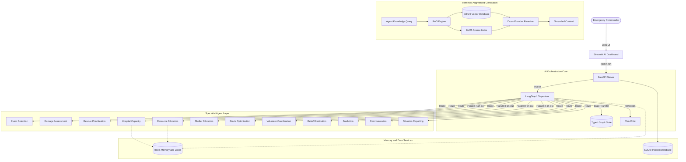
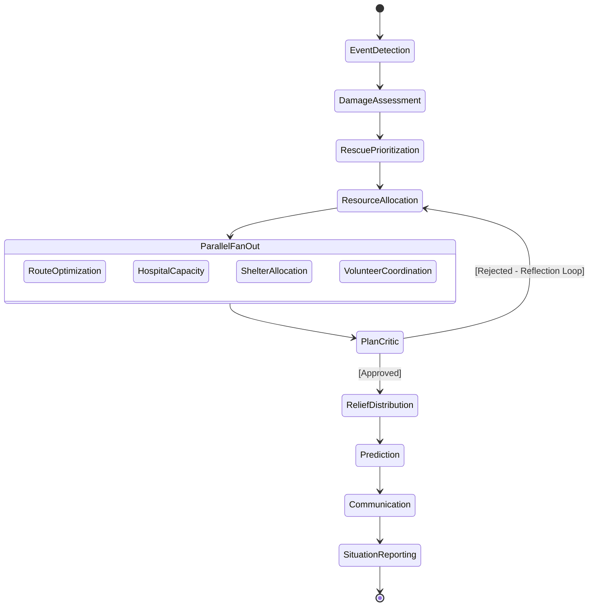
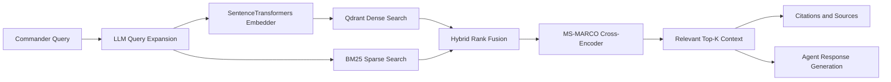
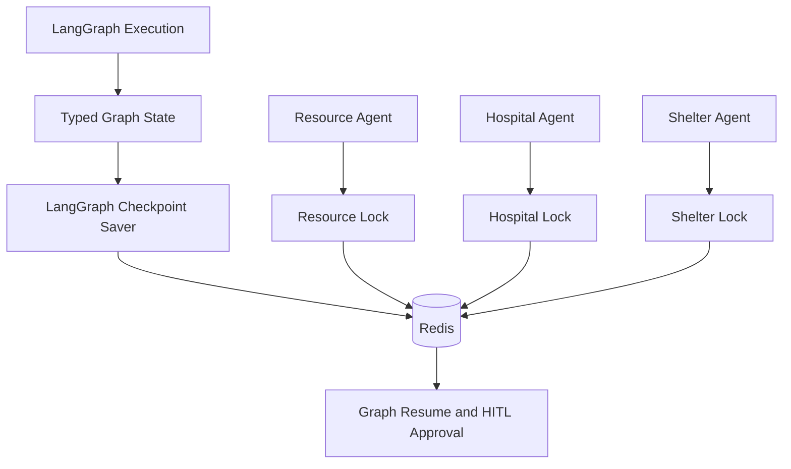

<div align="center">
  
  <h1>RescueNet AI</h1>
  <p><em>Autonomous Multi-Agent AI Command Center for Disaster Response</em></p>

  [](https://www.python.org/downloads/)
  [](https://fastapi.tiangolo.com/)
  [](https://langchain-ai.github.io/langgraph/)
  [](https://www.langchain.com/)
  [](https://www.docker.com/)
  [](https://redis.io/)
  [](https://qdrant.tech/)
  [](https://opensource.org/licenses/MIT)

</div>

---

## Live Application

- **Frontend Command Dashboard:** [rescuenet-frontend-yq8j.onrender.com](https://rescuenet-frontend-yq8j.onrender.com)
- **Backend REST API:** [rescuenet-backend-v9b1.onrender.com](https://rescuenet-backend-v9b1.onrender.com)
- **Interactive API documentation:** `https://rescuenet-backend-v9b1.onrender.com/docs`

> The API exposes OpenAPI/Swagger documentation at `/docs` and a service health endpoint at `/health`.

## Overview

**RescueNet AI** is an AI/ML disaster-response orchestration platform that coordinates specialized agents across damage assessment, rescue prioritization, resource dispatch, hospital capacity, shelter allocation, route optimization, relief planning, volunteer coordination, communication, prediction, and situation reporting.

The platform combines **large-language-model reasoning**, **agentic workflow orchestration**, **Retrieval-Augmented Generation (RAG)**, **vector search**, **structured output validation**, **human-in-the-loop control**, and **shared operational memory**. A LangGraph supervisor maintains the execution state, routes work to specialist agents, evaluates plans, and coordinates reflection loops before generating an operational situation report.

RescueNet AI is designed for emergency-command scenarios where decisions must be traceable, structured, context-aware, and grounded in operational knowledge.

### Project goals

- Reduce coordination delays between emergency agencies.
- Convert incident reports into structured response plans.
- Ground agent responses in emergency operating procedures.
- Prevent duplicate allocation of limited resources.
- Provide an auditable execution trace for every response.
- Keep human operators in control of sensitive actions.
- Present live operational intelligence through an interactive dashboard.

### SDG alignment

- **SDG 11 — Sustainable Cities and Communities:** improves urban disaster resilience.
- **SDG 13 — Climate Action:** supports response planning for climate-related hazards.

---

## Core AI/ML Capabilities

| Capability | Description |
|:---|:---|
| **Multi-Agent AI** | Specialized agents reason over separate rescue domains and return typed outputs. |
| **LangGraph Supervisor** | Stateful graph orchestration, conditional routing, parallel fan-out, and reflection loops. |
| **LLM Reasoning** | Groq/Llama-compatible model integration through LangChain adapters. |
| **Structured Generation** | Pydantic schemas validate agent outputs such as events, assignments, alerts, forecasts, and reports. |
| **Agentic RAG** | Hybrid dense and sparse retrieval over emergency guidelines with reranking and citations. |
| **Qdrant Vector Search** | Semantic vector storage and retrieval for operational procedures and knowledge documents. |
| **BM25 Retrieval** | Sparse keyword retrieval for exact emergency terms, protocols, and named procedures. |
| **Cross-Encoder Reranking** | Reorders candidate passages to improve context relevance before generation. |
| **Redis Memory Layer** | Distributed locks, shared working memory, and LangGraph checkpoint persistence. |
| **Human-in-the-Loop** | Approval checkpoints for resource dispatch and public communication actions. |
| **Operational Simulation** | Hospitals, shelters, vehicles, volunteers, routes, and affected zones are represented as live state. |
| **Prediction Agent** | Produces short-horizon forecasts from disaster severity, affected zones, and response state. |
| **Multilingual Communication** | Generates structured emergency alerts and communication payloads. |
| **Interactive Geospatial UI** | PyDeck maps, heatmaps, scatterplots, route arcs, and response metrics. |
| **REST API** | FastAPI endpoints for triggers, state, incidents, simulation, RAG, and operational reporting. |
| **Observability** | Structured JSON logs, agent traces, metrics, and request-level execution history. |

---

## System Architecture

RescueNet AI uses a service-oriented architecture with a Streamlit command dashboard, FastAPI API layer, LangGraph orchestration engine, specialist AI agents, Redis memory, SQLite operational persistence, and Qdrant retrieval.



### Component responsibilities

1. **Streamlit Dashboard:** command interface for incident triggers, RAG questions, live state, maps, metrics, alerts, and execution traces.
2. **FastAPI Backend:** REST endpoints, request validation, rate limiting, API documentation, and orchestration entrypoints.
3. **LangGraph Supervisor:** controls graph execution, routing, fan-out, reflection, approval checkpoints, and final state assembly.
4. **Specialist Agents:** LangChain-compatible nodes that transform graph state into typed operational decisions.
5. **Redis:** shared locks, working memory, and checkpoint storage for graph execution.
6. **SQLite:** incident history and operational persistence.
7. **Qdrant:** vector database for emergency manuals, SOPs, protocols, and retrieved context.
8. **RAG Engine:** combines dense retrieval, BM25 search, score fusion, reranking, citations, and grounded answer generation.

For deeper details, see [docs/ARCHITECTURE.md](docs/ARCHITECTURE.md).

---

## LangGraph Workflow

The response engine is modeled as a typed state graph rather than a simple linear request handler. Independent work can fan out concurrently, while dependent tasks wait for the required state fields.



### Workflow characteristics

- Typed shared state through Pydantic and `GraphState`.
- Conditional supervisor routing.
- Parallel specialist execution after resource prioritization.
- Reflection and replanning through the PlanCritic node.
- Human approval checkpoints before sensitive actions.
- Agent execution traces persisted into the final situation report.
- Structured error handling and validated state transitions.

For the full workflow specification, see [docs/LANGGRAPH_WORKFLOW.md](docs/LANGGRAPH_WORKFLOW.md).

---

## AI Agent Architecture

| Agent | AI responsibility | Structured output | Tool integrations |
|:---|:---|:---|:---|
| **Supervisor** | Routes graph execution and manages dependencies. | `GraphState` updates | LangGraph routing |
| **PlanCritic** | Evaluates resource plans and initiates reflection. | Approval or rejection decision | Validation rules |
| **Event Detection** | Classifies and structures incoming disaster reports. | `DisasterEvent` | Geolocation and incident metadata |
| **Damage Assessment** | Estimates affected zones, impact, and casualties. | `List[DamageReport]` | Geospatial/OSM query tools |
| **Rescue Prioritization** | Ranks targets by severity, vulnerability, and urgency. | `List[PriorityItem]` | Vulnerability data |
| **Resource Allocation** | Matches vehicles and response resources to priorities. | `List[ResourceAssignment]` | Distance and ETA calculation |
| **Route Optimization** | Produces routes and adjusts for blocked roads. | `List[RouteInfo]` | Traffic and route tools |
| **Hospital Capacity** | Assigns casualties to available medical capacity. | `List[HospitalAssignment]` | Hospital telemetry |
| **Shelter Allocation** | Assigns displaced people to appropriate shelters. | `List[ShelterAssignment]` | Shelter conditions and capacity |
| **Volunteer Coordination** | Matches volunteer skills to operational needs. | `List[VolunteerAssignment]` | Volunteer availability |
| **Relief Distribution** | Plans food, water, blankets, and medical kits. | Relief allocation state | Resource inventory |
| **Prediction** | Estimates near-term spread and response demand. | `List[Forecast]` | Weather and historical data |
| **Communication** | Generates emergency alerts and multilingual messaging. | `List[Alert]` | Communication gateway adapters |
| **Situation Reporting** | Produces an executive operational summary. | Markdown report | Full graph state |

The agent implementations are located in [`backend/agents/`](backend/agents/). See [docs/AI_AGENTS.md](docs/AI_AGENTS.md) for prompt architecture and agent contracts.

---

## Retrieval-Augmented Generation

RescueNet AI combines semantic retrieval and lexical search to provide context-grounded answers from emergency operating procedures.



### RAG pipeline stages

1. Normalize and validate the incoming question.
2. Expand terminology when the LLM query-expansion adapter is enabled.
3. Encode the question for semantic search.
4. Retrieve relevant passages from Qdrant.
5. Retrieve exact and related terms through BM25.
6. Merge and deduplicate candidate passages.
7. Rerank candidates with a cross-encoder.
8. Apply relevance thresholds and metadata filters.
9. Generate a cited response from the selected context.
10. Return answer text, citations, confidence, and processing metadata.

See [docs/RAG_DESIGN.md](docs/RAG_DESIGN.md) for the detailed retrieval design.

---

## Memory and State Architecture

Redis provides the shared coordination layer for concurrent agents and graph execution.



### Memory responsibilities

- **Working memory:** resource availability, hospital beds, shelter capacity, volunteer state, and operational locks.
- **Distributed locking:** prevents two concurrent agents from claiming the same response resource.
- **LangGraph checkpoints:** preserve graph state between node transitions and approval checkpoints.
- **Incident persistence:** SQLite stores completed incident reports and historical response records.
- **Vector memory:** Qdrant stores embedded emergency knowledge and retrieval metadata.

See [docs/MEMORY_ARCHITECTURE.md](docs/MEMORY_ARCHITECTURE.md).

---

## API Overview

FastAPI exposes a documented REST API. OpenAPI documentation is available at `/docs` and `/redoc`.

### Health

```http
GET /health
```

### Trigger a disaster response

```http
POST /api/disaster/trigger
Content-Type: application/json
```

```json
{
  "disaster_type": "flood",
  "location_name": "Delhi NCR",
  "lat": 28.6139,
  "lon": 77.2090
}
```

The response includes the structured event, damage assessments, priorities, resource assignments, routes, hospital assignments, shelter assignments, relief plan, volunteer plan, forecasts, alerts, narrative report, and agent execution trace.

### RAG search

```http
POST /api/rag/search
Content-Type: application/json
```

```json
{
  "query": "What should emergency teams do during a flood?"
}
```

### Operational endpoints

| Endpoint | Purpose |
|:---|:---|
| `GET /api/state` | Current hospitals, shelters, resources, and volunteers. |
| `GET /api/simulation/state` | Current simulation state. |
| `POST /api/simulation/tick` | Advance the simulation. |
| `POST /api/reset` | Reset operational state. |
| `GET /api/incidents` | List historical incidents. |
| `GET /api/incidents/{incident_id}` | Retrieve one complete incident report. |
| `POST /api/rag/ingest` | Ingest knowledge documents into the RAG system. |

See [docs/API_REFERENCE.md](docs/API_REFERENCE.md) for the complete API surface.

---

## Technology Stack

| Layer | Technologies |
|:---|:---|
| **Frontend** | Streamlit, PyDeck, Plotly, Requests |
| **API** | FastAPI, Uvicorn, Gunicorn, Pydantic, SlowAPI |
| **AI orchestration** | LangGraph, LangChain, Groq/Llama-compatible models |
| **Agent state** | Pydantic `GraphState`, typed state channels, structured outputs |
| **RAG** | Qdrant, BM25, SentenceTransformers, Cross-Encoder reranking |
| **Working memory** | Redis, distributed locks, LangGraph checkpointing |
| **Operational database** | SQLite |
| **Deployment** | Docker, Docker Compose, Render-compatible services |
| **Observability** | Structured JSON logs, agent traces, pipeline metrics |
| **Testing** | Pytest, Pytest-Asyncio, Pytest-Cov |

---

## Installation and Quickstart

### Prerequisites

- Python 3.12+
- Docker and Docker Compose
- Redis
- Qdrant
- A compatible LLM provider key for model-powered inference

### Clone the repository

```bash
git clone https://github.com/narayan8447/rescuenet-ai.git
cd rescuenet-ai
```

### Configure environment variables

Create a `.env` file:

```env
GROQ_API_KEY=gsk_your_groq_api_key_here
GROQ_MODEL=llama-3.3-70b-versatile
REDIS_URL=redis://redis:6379/0
QDRANT_URL=http://qdrant:6333
API_BASE=http://backend:8000
USE_FAKE_REDIS=false
```

### Launch the complete stack

```bash
docker compose up --build -d
```

Services:

- Dashboard: `http://localhost:8501`
- Backend API: `http://localhost:8000`
- Swagger UI: `http://localhost:8000/docs`
- Qdrant dashboard: `http://localhost:6333/dashboard`

### Local Python development

```bash
python3 -m venv .venv
source .venv/bin/activate
pip install -r requirements.txt
pip install -r frontend/requirements.txt
pytest -q
```

Run the backend:

```bash
uvicorn backend.main:app --host 127.0.0.1 --port 8000 --reload
```

Run the dashboard in a separate terminal:

```bash
API_BASE=http://127.0.0.1:8000 streamlit run frontend/app.py --server.port 8501
```

For deployment details, see [docs/DEPLOYMENT.md](docs/DEPLOYMENT.md).

---

## Repository Documentation

- [Architecture](docs/ARCHITECTURE.md)
- [AI Agents](docs/AI_AGENTS.md)
- [LangGraph Workflow](docs/LANGGRAPH_WORKFLOW.md)
- [State Schema](docs/STATE_SCHEMA.md)
- [Message Protocol](docs/MESSAGE_PROTOCOL.md)
- [RAG Design](docs/RAG_DESIGN.md)
- [Memory Architecture](docs/MEMORY_ARCHITECTURE.md)
- [Simulation Engine](docs/SIMULATION_ENGINE.md)
- [API Reference](docs/API_REFERENCE.md)
- [Deployment Guide](docs/DEPLOYMENT.md)
- [Security](docs/SECURITY.md)
- [Performance](docs/PERFORMANCE.md)
- [Troubleshooting](docs/TROUBLESHOOTING.md)
- [Project Structure](docs/PROJECT_STRUCTURE.md)
- [Contributing](docs/CONTRIBUTING.md)

---

## Testing

Run the full test suite:

```bash
pytest -q
```

The tests cover:

- Core agent contracts
- Shared memory behavior
- RAG retrieval and metadata filtering
- Simulation state transitions
- Supervisor graph execution
- API-compatible structured outputs

---

## Contributing

Contributions are welcome from the AI, ML, emergency-management, distributed-systems, and open-source communities.

1. Create a feature branch.
2. Add or update tests.
3. Run `pytest -q`.
4. Update the relevant architecture documentation.
5. Open a pull request with a clear technical summary.

See [docs/CONTRIBUTING.md](docs/CONTRIBUTING.md).

---

## License

This project is licensed under the MIT License. See [LICENSE](LICENSE) for details.

## Credits

- Developed for the **IBM SkillsBuild Advanced AI** competition.
- Built with [LangGraph](https://github.com/langchain-ai/langgraph), [LangChain](https://www.langchain.com/), [FastAPI](https://fastapi.tiangolo.com/), [Qdrant](https://qdrant.tech/), [Redis](https://redis.io/), and [Streamlit](https://streamlit.io/).
- Architecture by the RescueNet AI Team.
